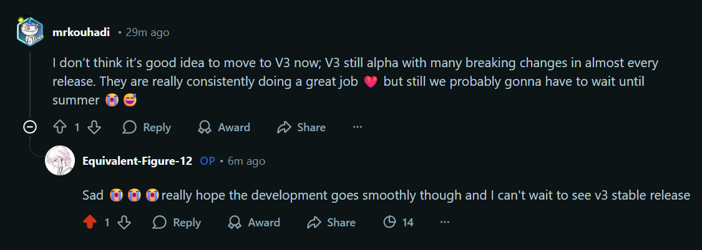
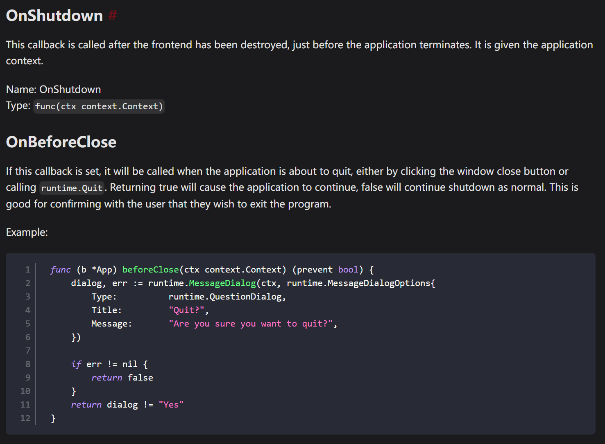
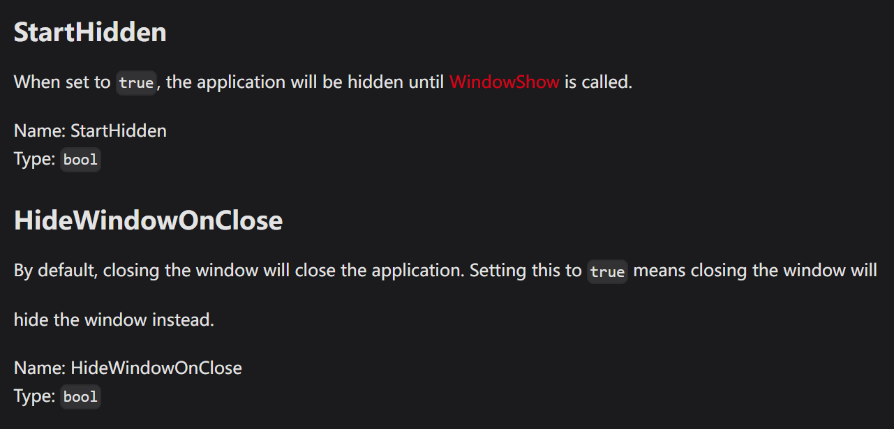

## 背景

开发LunaBox也有小半个月了，也算是半深度用了wails这个跨端方案

这一路上可谓是又爱又恨，一方面go + react这种开发模式是真的爽

- 比tauri编译稍微快了一些
- 比electron的包小
- golang还比较熟悉
- 最最重要的是还能使用我(和ai)最爱的web前端开发那一套😋👍

每天要干的事情就是看ai在vscode里杀穿前后端，为ai处理一些它看不懂的疑难杂症，顺便稍稍cr一下ai的代码，go和react这两位ai大部分也不会写错，开发效率杠杠滴

但是另一方面wails v2也有一些让人心(绞)痛的缺点，虽然说作者说在v3里会解决（事实上也真的解决了），但是作者迟迟不发wails v3，每个月还能有break-change，从2020年到现在已经5年了，哪吒都两岁了吧喂喂(ﾟДﾟ*)ﾉ

当时也算是没做好技术选型就上了，满脑子都是golang，现在吃了苦，想升级v3都不行，这里就写一些缺点，方便有想用wails进行桌面端开发的同学参考，如果你能接受并处理好，就放心大胆的去用吧


## 槽点

### 1. 没有内置托盘功能

是的，你没听错，偌大一个wails v2居然没有内置托盘功能!!
这意味着你需要自己去找第三方库来实现托盘功能，比如[systray](https://github.com/getlantern/systray)一类的东西。

用是可以用的，但是就是不太好用，你需要处理wails v2提供的窗口生命周期和systray的生命周期之间的关系，还有搞明白几个重要的参数和程序行为。





窗口会有3个行为，分别是Quit，Hide和Show

- Quit - 销毁前端WebView，后端也准备停止工作
- Hide - WebView后台运行，但不显示托盘图标，后端也正常工作，对应`runtime.WindowHide(ctx)`
- Show - 唤出WebView前台运行，对应`runtime.WindowShow(ctx)`

当你点击了关闭按钮，wails会捕捉到这个系统行为，调用`runtime.Quit()`尝试正常退出。

```go
// Quit the application
func Quit(ctx context.Context) {
  if ctx == nil {
    log.Fatalf("Error calling 'runtime.Quit': %s", contextError)
  }
  appFrontend := getFrontend(ctx)
  appFrontend.Quit()
}

//\wails\v2@v2.11.0\internal\frontend\desktop\windows\frontend.go
func (f *Frontend) Quit() {
  if f.frontendOptions.OnBeforeClose != nil && f.frontendOptions.OnBeforeClose(f.ctx) {
    return
  }
  // Exit must be called on the Main-Thread. It calls PostQuitMessage which sends the WM_QUIT message to the thread's
  // message queue and our message queue runs on the Main-Thread.
  f.mainWindow.Invoke(winc.Exit)
}
```

需要注意的是，wails中`HideWindowOnClose`的优先级会高于`OnBeforeClose`，即只要配置了`HideWindowOnClose`为true，你点击关闭按钮窗口会直接Hide，WebView最小化工作，你的程序就退出不了了！

所以你只能在`OnBeforeClose`中去手动判断用户究竟是要退出，还是要最小化到托盘工作，我使用了一个goroutine异步运行托盘，通过chan来和walis主进程同步生命周期。

```go
OnBeforeClose: func(ctx context.Context) bool {
  // 如果是从托盘强制退出，直接允许关闭
  if forceQuit {
    return false
  }
  if config.CloseToTray {
    runtime.WindowHide(ctx)
    return true
  }
  return false
},

OnStartup: func(ctx context.Context) {
  appCtx = ctx
  // .......

  configService.Init(ctx, db, config)
  // 设置安全退出回调
  configService.SetQuitHandler(func() {
    forceQuit = true
    runtime.Quit(ctx)
  })

  //......

  // 在 Wails 启动后初始化系统托盘
  systrayQuit = make(chan struct{})
  go systray.Run(onSystrayReady, onSystrayExit)
},

OnShutdown: func(ctx context.Context) {
  // 关闭系统托盘
  if systrayQuit != nil {
    systray.Quit()
    <-systrayQuit // 等待 systray 完全退出
  }

  //......

  // 保存配置
  if err := appconf.SaveConfig(config); err != nil {
    appLogger.Error("failed to save config: " + err.Error())
  }
}
```

托盘的配置如下：

```go
// 系统托盘初始化
func onSystrayReady() {
  systray.SetIcon(icon)
  systray.SetTitle("LunaBox")
  systray.SetTooltip("LunaBox")

  // 点击托盘图标时显示窗口
  systray.SetOnClick(func(menu systray.IMenu) {
    if appCtx != nil {
      runtime.WindowShow(appCtx)
    }
  })

  // 双击托盘图标时也显示窗口
  systray.SetOnDClick(func(menu systray.IMenu) {
    if appCtx != nil {
      runtime.WindowShow(appCtx)
    }
  })

  mShow := systray.AddMenuItem("显示主窗口", "显示 LunaBox 主窗口")
  systray.AddSeparator()
  mQuit := systray.AddMenuItem("退出", "退出 LunaBox")

  mShow.Click(func() {
    if appCtx != nil {
      runtime.WindowShow(appCtx)
    }
  })

  mQuit.Click(func() {
    // 通过托盘退出时，设置强制退出标志，绕过 OnBeforeClose 的最小化逻辑
    forceQuit = true
    if appCtx != nil {
      runtime.Quit(appCtx)
    }
  })
}

func onSystrayExit() {
  if systrayQuit != nil {
    close(systrayQuit)
  }
}
```

因为我还有允许自动退出重新同步数据，所以还有一个`SafeForceQuit`,这里不多赘述。

现在这样写有点问题，就是托盘可能晚于主线程退出结束，两个系统的生命周期不同步，会导致托盘卡住，WebView无法换出的情况，但发生不经常，大概有1/10的概率，感觉是我自己的代码有待改进，欢迎大佬指点。

wails v3提供了原生系统托盘的选项，期待正式版放出。

### 2. Vite v5.0.0+ 下Wails开发服务器不再正确服务Assets文件

这意味着如果你使用了Vite v5.0.0+，Wails无法获取并展示一些本地资源，如图片等。

相关issue链接:

[Dynamic assets not loading in dev mode since updating vite to v5.0.0+ #3240](https://github.com/wailsapp/wails/issues/3240)

[feat!: appType (spa, mpa, custom), boolean middlewareMode #8452](https://github.com/vitejs/vite/pull/8452)

看问题描述好像问题是和 Vite 对于 SPA 或 MPA 不再起作用的问题相关，团队提到会在v3进行解决，在v2下，你需要一些特殊的处理方法解决这个问题，这里我通过 AssetServer.Middleware 实现了一个自定义的 HTTP 中间件来解决这个问题，大体思路是这样的：

1. 使用路径前缀 (/local/)，通过检查 URL 路径前缀，将特定路径的请求直接拦截并交给自定义的 localFileHandler 处理，完全绕过 Vite 的资源服务器。

2. 中间件在请求到达 Vite dev server 之前就处理了 /local/ 路径，避免了 Vite 的严格文件系统检查。

3. 同时添加了 CORS 支持，适用于开发环境，避免跨域问题。

代码如下：

```go
// main.go
AssetServer: &assetserver.Options{
  Assets: assets,
  Middleware: func(next http.Handler) http.Handler {
    return http.HandlerFunc(func(w http.ResponseWriter, r *http.Request) {
      // 跨域处理
      w.Header().Set("Access-Control-Allow-Origin", "*")
      w.Header().Set("Access-Control-Allow-Methods", "GET, POST, PUT, DELETE, OPTIONS")
      w.Header().Set("Access-Control-Allow-Headers", "Content-Type, Authorization")

      if r.Method == "OPTIONS" {
        w.WriteHeader(http.StatusOK)
        return
      }

      if strings.HasPrefix(r.URL.Path, "/local/") {
        localFileHandler.ServeHTTP(w, r)
        return
      }

      next.ServeHTTP(w, r)
    })
  },
},

//internal/utils/local_file_handler.go

type LocalFileHandler struct {
  appDir string
}

func NewLocalFileHandler() (*LocalFileHandler, error) {
  appDir, err := GetDataDir()
  if err != nil {
    return nil, err
  }
  return &LocalFileHandler{
    appDir: appDir,
  }, nil
}

// ServeHTTP 实现 http.Handler 接口
func (h *LocalFileHandler) ServeHTTP(w http.ResponseWriter, r *http.Request) {
  // 只处理 /local/ 开头的请求
  if !strings.HasPrefix(r.URL.Path, "/local/") {
    http.NotFound(w, r)
    return
  }

  // 移除 /local/ 前缀
  relativePath := strings.TrimPrefix(r.URL.Path, "/local/")

  // 构建完整路径
  fullPath := filepath.Join(h.appDir, relativePath)

  // 清理路径
  cleanPath := filepath.Clean(fullPath)

  // 检查文件是否存在
  if _, err := os.Stat(cleanPath); os.IsNotExist(err) {
    http.NotFound(w, r)
    return
  }

  // 设置缓存头
  w.Header().Set("Cache-Control", "public, max-age=31536000")

  // 提供文件服务
  http.ServeFile(w, r, cleanPath)
}
```

### 3. 不支持内部多窗口功能

这就意味着无法实现你在 VS Code、Figma 或 JetBrains IDE 中看到的那种多窗口 / 多面板布局，你只能通过css划分出不同区域，而且共用同一个js主线程，效果并不好

这里我还没推进相关的需求，没有深入研究，所以暂时没有什么解决方案 XD

不过看[wails v3](https://v3alpha.wails.io/whats-new/)已经也准备原生支持了，非常期待，快快端上来吧🤓

## 总结

不过说到底，wails确实是一个非常好的框架，开发体验1等1的好，虽然目前有很多问题，但是相信随着社区的努力，这个项目会越来越好的
